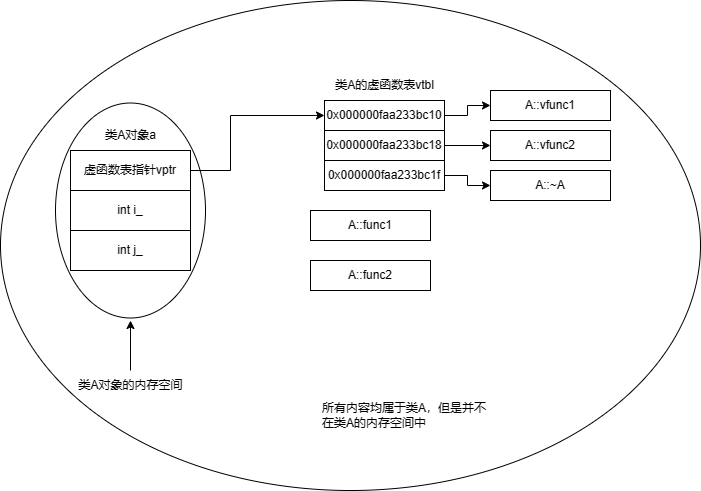
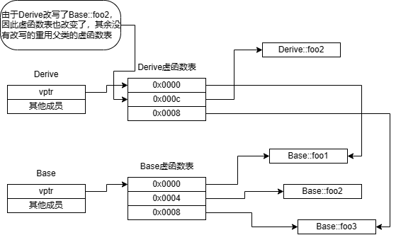

# OOP 特性

## 继承

类的派生是指，通过使用现有类作为基础建立新类的过程。原先的类被称为基类、父类或超类，而新建立的类被称为派生类、子类。

---

成员权限开放程度

1. public: 在任何地方都可以访问。
2. protected: 在派生类中可以访问，类的对象无法访问。
3. private: 在类内部可以访问，类的对象以及派生类中无法访问。

由此可见开放程度为```public > protected > private```。

在C++中，类通过```public```、```protected```和```private```来控制派生配或者外部访问类的权限。public下的成员使用最宽松，可被继承以及通过对象访问。protected下的成员只能被继承，不能通过对象访问。private下的成员只能被类本身使用。

```cpp
#include <iostream>

class Foo {
public:
    void public_func() {std::cout << "public_func" << std::endl;}
protected:
    void protected_func() {std::cout << "protected_func" << std::endl;}
private:
    int i_;
};

int main() {
    Foo foo;
    foo.public_func(); // 正确
    foo.protected_func(); // 错误
    foo.i_ = 0; // 错误
}
```

---

根据继承的方式不同，子类获得的父类成员以及权限也不同，如下表：

|父类权限|继承方式|子类获得权限|
|---|---|---|
|pubic|public|public|
|protected||protected|
|private||no access|
|public|protected|protected|
|protected||protected|
|private||no access|
|public|private|private|
|protected||private|
|private||no access|

简单概述: 在最开放的继承权限下，除private成员外其他成员按照原始权限继承。当继承权限范围缩小时，父类超出继承权限的成员到子类中会缩减到继承权限相同的范围。父类private成员永远无法继承。

---

三种继承方式：
1. 单一继承：一个子类只有一个父类，且只能继承一个父类。
2. 多重继承：一个子类可以有多个父类，类与类之间用逗号分隔，并且类名前要有权限。若不同父类中有重名成员则在调用时需要加类名限定符```obj.class::member = 1;```。
3. 菱形继承：1-n-1模式，也就是B、C分别虚拟继承自A，然后D再继承于B、C。

## 封装

将数据和对数据的操作封装在一起，使用struct、class等关键字。将接口暴露给外界，外界只知道接口，不知道内部是如何实现的，可以达到隐藏内部信息同时又可以实现代码的重用。

## 多态

不同的对象通过同一个接口调用，产生不同的执行结果。多态有两种形式，一种是静态多态，一种是动态多态。

静态多态: 对于不同但是相似的对象模型直接实现对应的定义，但是要求接口声明相同。

动态多态: 对于两个相似的对象，将其中公共的部分声明为公共的虚函数，接下来由子类重写虚函数完成不同的功能。

---

多态的实现方式

1. 重载: 函数重载或者运算符重载，编译期（静态多态）。
2. 虚函数: 方法的行为取决于调用方法的对象。运行时（动态多态）。
3. 模板: 编译期（静态多态）。

# 虚函数与多态

问题: 

1. 什么是虚函数表？什么是虚函数表指针？
2. C++中的多态特性是如何体现的？具体实现细节是什么？

```cpp
#include <iostream>

class A {
public:
   void func1() {}
   void func2() {}
   virtual void vfunc() {}
};

int main() {
   A a;
   std::cout << sizeof(a) << std::endl;
}
```

我们需要注意两件事情: 
1. 当我们创建一个空类A时，并且使用sizeof()查看其大小，会发现值为1，就算是空类，也不会是0字节，最少都是1字节。并且添加两个函数之后类A的大小仍为1，因此类中的函数并不占用类A的空间。
2. 接着我们添加一个虚函数vfunc()，此时类A的大小变为8（此数值是根据不同编译器确定的，在64位编译器下值为8字节，每个字节8比特，也就是64比特。在32位编译器下此数值是4字节），也就是当我们向类中添加一个虚函数时，的的确确的向类A中添加了内容。

**那么添加了什么东西？**

只要在类中存在大于等于一个虚函数的时候，就会在类中添加一个虚函数表指针，这个虚函数表指针会指向一个虚函数表。

```cpp
#include <iostream>

class A {
public:
   // void *vptr;   // 虚函数表指针
   virtual void vfunc() {}
};
```

当类A中至少存在一个虚函数的时候，在编译期间就会为类A生成一个虚函数表。

**那虚函数表指针是什么时候被赋值的？**

在有虚函数的类被编译时，编译器会向构造函数中插入虚函数表指针赋值语句，如果没有构造函数，编译器会生成默认构造函数，并且向其中插入虚函数表指针赋值语句。

```cpp
class A {
   A() {vptr = &A::vtbl;}
}
```

当生成类A的实例的时候，就会执行构造函数中插入的虚函数表指针赋值语句，使虚函数表指针指向对应的虚函数表。

**类对象在内存中的布局究竟是什么？**

```cpp
class A {
public:
   void func1() {}
   void func2() {}
   virtual void vfunc1() {}
   virtual void vfunc2() {}
   virtual ~A() {}
private:
   int i_;
   int j_;
}
```

接下来使用上面的类来较为完整的展示一下类对象在内存中的布局。



**虚函数的工作原理以及多态性的体现**

当通过父类指针new一个子类对象或者将父类的引用绑定到子类的对象时，使用父类的指针调用虚函数时调用的其实是子类的虚函数。

要确定是否是多态性的体现可以通过: 是否是通过虚函数表指针查询了虚函数表，再通过虚函数表查询到虚函数来执行的。

```cpp
class A {
public:
   virtual void vfunc() {}
};

// 是多态
// 通过定义类A的指针new一个类A的对象
A* pa1 = new A();
pa1->vfunc();

// 不是多态
// 通过类A的对象直接调用函数，并非通过虚函数表进行查找
A a;
a.vfunc();

// 是多态
// 通过绑定类A的地址调用虚函数。
A* pa2 = &a;
pa2->vfunc();
```

更一般的方式是既有父类也有子类，同时父类中有虚函数，子类中必须重写父类的虚函数。同时父类指针要指向子类对象，或者是父类引用要绑定到子类对象。接着只要使用父类的指针或者引用调用子类的虚函数时，就会发生多态。

```cpp
#include <iostream>

class Base {
public:
    virtual void foo() {}
};

class Derived : public Base {
public:
    virtual void foo() {std::cout << "in derived" << std::endl;}
};

int main() {
   // 一下三种方式都是多态。运行的都是子类中重写的虚函数。

    Derived derived;
    // 通过将父类的指针指向子类的对象。
    Base* base = &derived;
    base->foo();

    // 通过将父类的引用绑定到子类的对象。
    Base& base2 = derived;
    base2.foo();

    // 通过父类的指针new一个子类对象
    Base* base3 = new Derived();
    base3->foo();
}
```

子类与父类的内存布局以及虚函数表详细情况如下: 



# 重写、重载与隐藏

# 内存布局