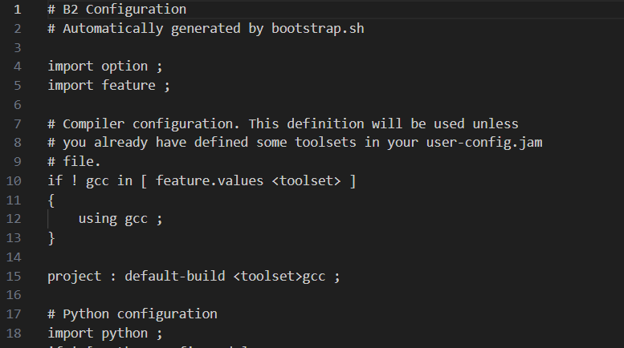

# 编译

首先运行`./bootstrap.sh --with-toolset=gcc`，运行结束之后会产生一个`project-config.jam`文件，在这个文件中修改12行，添加以下内容

`using gcc : arm : /usr/bin/aarch64-linux-gnu-g++-8 ;`

**要注意，在上面分号前一定要有空格，不然无法识别！！！**
**要注意，在上面分号前一定要有空格，不然无法识别！！！**
**要注意，在上面分号前一定要有空格，不然无法识别！！！**



`./b2 toolset=gcc target-os=linux architecture=arm address-model=64`

使用`-a`来重新进行编译。

在编译完成之后使用`./b2 install`将其安装到默认的路径。

# asio

在使用boost库的asio时要依赖pthread，要按照以下方式编写cmake文件

```cmake
find_package(Boost REQUIRED COMPONENTS system)
find_package(Threads REQUIRED)

target_include_directories(${PROJECT_NAME} PRIVATE ${Boost_INCLUDE_DIRS})
target_link_libraries(${PROJECT_NAME} PRIVATE Boost::json Boost::system Threads::Threads)
```