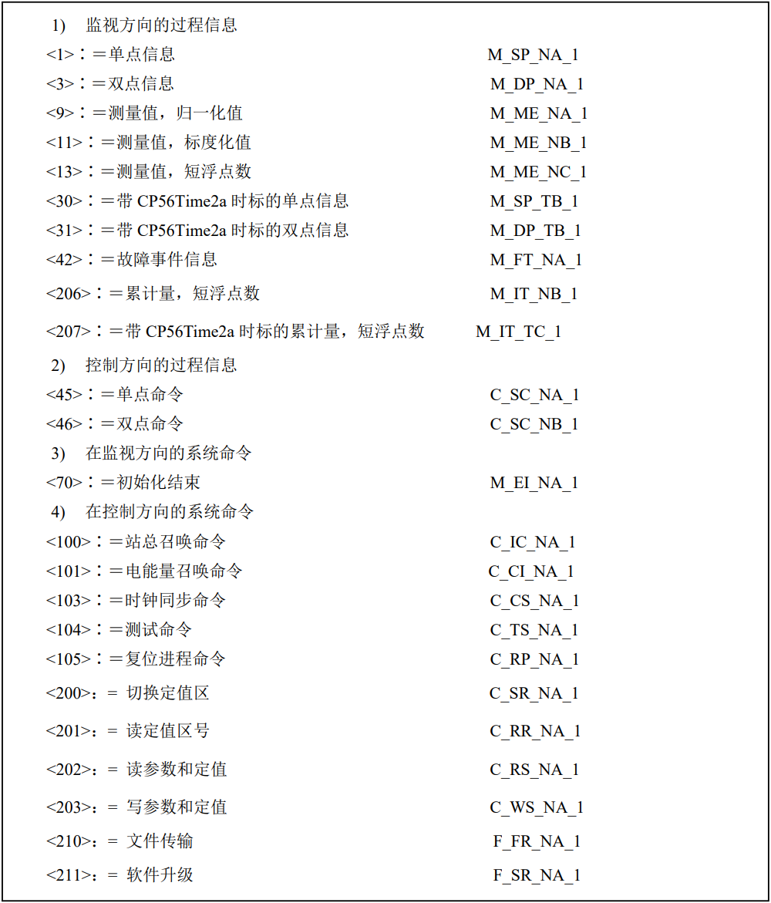
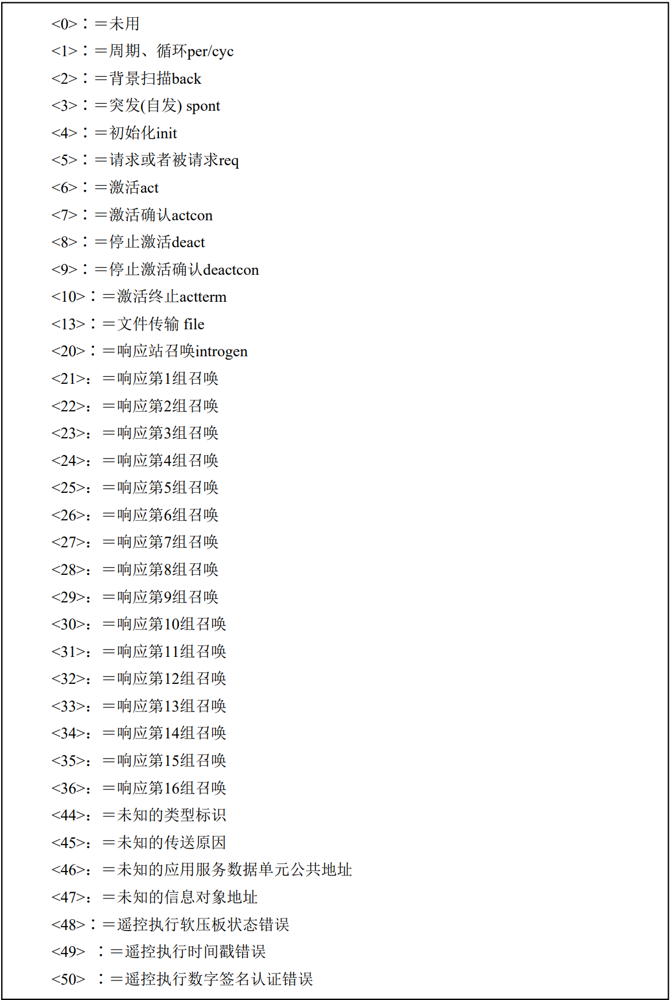

# 基本概念

IEC104是基于TCP协议的应用层协议。其架构为C/S架构，server负责实际硬件控制、数据采集、命令执行，因此也被称为受控站或者是分站（slave）client负责远程控制，包括数据采集配置server也被称为控制站，或者主站（master）。

# 协议帧结构

一个APDU被称为一个应用协议数据单元，也就是一个IEC104协议帧，一个APDU包含一个APCI和ASDU，一个APDU的最大长度为255字节。

## APCI

是应用层控制信息，类似于帧头，由一个字节的起始地址一字节的APDU长度和四个一字节的控制位域组成。

### 控制帧

根据第一个控制域的不同定义了三种不同格式的帧。

1. I帧

    

     - I帧的数据帧APDU总是包含ASDU，也就是实际要传输的数据。
     - 控制域表明了消息的方向其中包含两个15比特的序号数字，每个方向上序号数字都会被有序加1，并且在0~32767之间循环。这个序号是用来判断每个包是否出现了乱序丢失重传的，如果一旦出现了这种情况则表明传输层的TCP连接出现了问题，应该断开此TCP连接重新建立新的连接。
     - 
     - 发送器当发送一个I帧后会将发送序号自动加一，同时将此I帧保存在发送缓冲区中，直到它接受到一个APDU的时候该APDU中接受序号表明接收到发送端发送的

2. S帧
    S帧格式只包含APCI，
    

3. U帧
    U帧格式只包含APCI，并且在同一时刻`TESTFR` `STOPDT` `STARTDT`中只能由一个功能可以被激活。
    

# ASDU基本格式

1. 1字节 类型限定符
2. 1字节 可变结构限定词
3. 2字节 传送原因
4. 2字节 ASDU公共地址
5. 3字节 信息对象地址。

一组信息元素集可以是单个信息元素/信息元素集合、单个信息元素序列或信息元素集合序列，区分这两种的方法是根据可变结构限定词中的最高位`SQ`表示的。

## 类型标识

使用一个字节来表示传输信息的类型。

信息对象是否带时标由标识类型的不同序号来区分。配电主站将舍弃那些类型标识未被定义的ASDU。

## 可变结构限定词

最高位是`SQ`取值位0或1，当SQ取0的时候标识离散的信息对象数据，当SQ取1的时候表示连续的信息元素数目。

 - SQ=0 表示所给出的数据并不是连续的，我们需要根据每个数据对象给出其地址。
 - SQ=1 表示给出的多个信息对象是连续的，只有第一个信息对象有地址，其他对象地址依次加1。这样其他对象都比第一个对象少了对象地址，在传输时可以压缩信息传输时间，

> 在总召唤的时候需要所有的信息因此为了传输效率将SQ设置为1，从站主动上报变动数据时，地址不连续则采用SQ=0

后续从1-7位十进制从0-127表示信息对象的数目，0表示不含ASDU不含信息对象。

## 传送原因

使用一个字节来表示传输原因

 - 8位：`T` `test`取值0或1，0表示未实验，1表示实验，一般为0
 - 7位：`P/N`取值0或1，0表示肯定确认表示报文有效，1表示否定确认表示报文无效。
 - 1-6位：十进制0-63表示传输原因，其中0表示未定义。

# 超时定义

1. t0：默认值30s，应用层104协议主动向传输层TCP发起连接请求，如果在30s之内没有收到答复则将其判断为无法与另一端建立连接。后续对应操作为重新发起TCP连接请求，可设置多次重连尝试。
2. t1：默认值15s，当某一方发送一个报文后经过t1时间没有收到另一方对发出报文的回应（I帧U帧都会有此计时器），则将其判断为数据丢失。后续操作为主动关闭tcp连接随后主动打开。
3. t2：默认值为10s，当发送方向接受方发送报文之后，接收方只能被动的接收报文，如果这是一个单向的过程，也就是发送方只发送，接收方只接收，接收方应该设置一个设置一个定时器当超过这个时间之后接收方应该对最后一个有效的报文进行回复（单向时回复S帧），发送方接收到这个报文之后就可以确定之前传输的数据已经安全的送达接收方，并且将对应的报文移出缓冲区。需要注意这个这个定时器是在接收方设置的，它应该赶在发送方将报文判断为丢失之前结束，也就是t2 < t1。后续对应操作为接收方向发送方发送一个对之前接收报文进行确认的报文。
4. t3：应用层协议是建立在传输层之上的，虽然连接建立了，但并不是每时每刻都会有数据传输的发生，对于这种情况AB双方都会独立的监视这条链路，对于双方来说，任意一方的t3定时器超时后都会向这条链路发送一个U帧（TESTFR）生效报文，来对这条链路的连通性进行测试，另一方收到这条报文之后要回复一条U（TESTFR）确认报文来对上一条进行回应。对于任意一方如果在t3定时器超时之前收到了一条U帧（TESTFR）报文则不会发送测试帧，而是用确认帧对其进行响应。

# 防止报文丢失和报文重复

我们在定义I帧格式的时候引入了发送序号和接收序号，其作用就是用来防止报文的丢失和重复，但是需要注意由于IEC104协议使用的是TCP传输层协议，其传输层协议提供了数据完整性的保障，因此如果一旦出现了丢失和重复的情况则一定是TCP连接出现了问题，并且解决方案就是断开此TCP连接重新建立一条TCP连接。

使用发送序号和接收序号检测报文丢失和重复的方法如下：

与学习TCP的方法类似，理解的单向传输发生了什么事情之后双向传输并不会更加复杂。

首先在TCP连接建立之后在发送方和接收方都会维护一组变量这些变量分别是：

1. V(S): 发送状态变量
2. V(R): 接收状态变量
3. ACK: 指示DTE已经正确收到所有小于或者等于这个编号的I格式APDU

并且使用`I(a, b)`来代表发送的I帧其中`a`为发送序号，`b`为接收序号

在TCP连接建立之后发送方和接收方双方都将这些变量初始化为0，首先发送方读取当前它维护的`V(S)`和`V(R)`，并将`V(S)`和`V(R)`放入I帧中，将其推入socket中交给传输层，随后发送方将`V(S)`进行自增同时将I帧放入一个队列中，当I帧到达接收方之后，接收方会将它维护的`V(R)`进行自增。当一段时间没有收到新的报文也就是t2计时器发生超时之后接收方会将保存的接收序号放入S帧中进行返回，

发送方可以在接收方没有响应的时候继续发送I帧，也就是重复上面的步骤。现在我们模拟的是一个单向发送的过程，接收方只进行接收，不会对发送方发送I帧，因此它会向发送方发送一个S帧作为响应告诉发送方之前的帧已经正确收到。