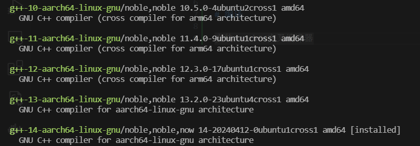
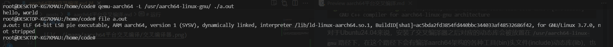
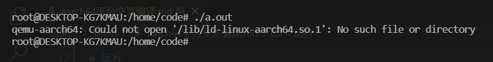

# 编译

安装aarch64交叉编译器，这里我只安装了aarch64的g++编译器，但是经过查询gcc编译器也会同时被安装。



对于Ubuntu24.04来说，安装了交叉编译器之后对应的动态库会被放置在`/usr/aarch64-linux-gnu`路径下，在这个路径下会有编译aarch64架构的各种工具(bin)头文件(include)动态库(lib)，也就是后续寻找头文件以及动态库的时候要寻找的路径。

在后面编写的时候使用cmake进行项目的管理，因此在编写cmake文件的时候要注意编译器的位置以及格式。

# 运行

因为编译出来的文件是aarch64架构的，无法直接在x86架构上直接运行，因此需要使用qemu运行，对于qemu的使用以后有时间再研究，目前的问题是如何在x86架构上直接直接运行aarch64架构的二进制文件，经过实验，可以安装`qemu-user`这个包，这个软件包提供了一些可直接执行其他平台二进制文件的工具。具体使用方法如下：



`qemu-user`这个包提供了很多平台的工具，其中一个就是`qemu-aarch64`这个命令后面直接跟要运行的对应平台的二进制文件，就可以运行。

其中有一点要进行说明的是`qemu-aarch64 -L /usr/aarch64-linux-gnu/`，首先二进制文件要连接动态库文件会首先从/lib下寻找，准确的说是`qemu-aarch64`这个程序会在这个目录下进行寻找，而我们使用`-L /path`可以指定二进制文件要连接的路径。其实如果在默认路径下存在对应动态库的话也可以直接运行，如果没有的话则会显示如下信息：



很明显可以看到这个错误信息是`qemu-aarch64`给出的，也就是说在能找得到动态链接库的情况下直接运行aarch64架构的二进制程序是可以默认调用`qemu-aarch64`程序运行程序的。

# 打包

打包涉及到具体运行软件的平台的包，对于华为AR502H来说，其中的容器使用deb包的，可以使用如下命令进行打包

```shell
dpkg-deb -b -Zxz ./packet ./packet/${appname}.deb
```

上述命令是将某个文件夹打包成对应的deb包，而AR502H中的容器是使用buster版本的debian，因此压缩格式要使用`xz`进行压缩，使用`-b`指定要进行打包。

# 注意事项

由于构建二进制可执行程序的编译器非常的新，动态库也会很新，而在对应终端运行程序中的动态库几乎一定无法运行，因此需要将几乎所有的动态库都打包进deb包中，这一点要在cmake构建编译的时候解决。